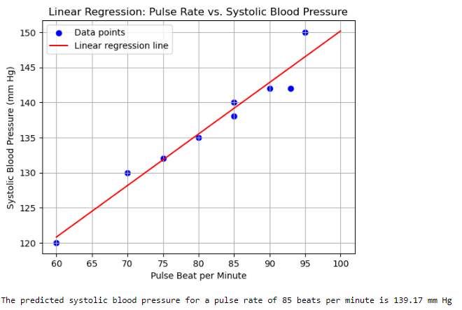

#  Linear Regression : Pulse Rate VS Blood-Pressure
> **Brief Description:** Establishing relationship between pulse rate and systolic blood pressure. As the pulse rate increases, systolic blood pressure tends to rise.
> 

---

## Table of Contents

- [Description](#description)
- [Video Explanation](#video)
- [Technologies Used](#technologies-used)
- [Dataset](#dataset)
- [Program Codes ](#program-codes)
- [Screenshots](#screenshots-and-explanations)
- [Contribution](#contributipn)
- [Contact Details](#contact-details)

---

## Description

Establishing relationship between pulse rate and systolic blood pressure. As the pulse rate increases, systolic blood pressure tends to rise.

## Video
<!--
 
-->

We are working on this section. Please check at some other time.

## Technologies-used

Python programming language, pandas and matplotlib package.

## Dataset

The data set is synthetically generated and used for demonstrating the concept only. The program can be easily modified to show results with real readings taken from the patients.

## Program-codes

The programs are written on jupiter notebook, You may run the program on Google colab by clicking on the colab badge below.

## Screenshots and explanations

### Interpretation of the Plot:

#### Title:
"Linear Regression: Pulse Rate vs. Systolic Blood Pressure"

#### Axes:
- **X-axis**: Pulse Beat per Minute
- **Y-axis**: Systolic Blood Pressure (mm Hg)

#### Data Points:
- Blue dots represent the original data points. These indicate the observed relationship between pulse rate (beats per minute) and systolic blood pressure (mm Hg).

#### Linear Regression Line:
- The red line represents the linear regression model. It shows the predicted systolic blood pressure based on the pulse rate.

#### Interpretation:
1. **Data Points**:
   - The data points are scattered around the linear regression line, indicating some variation in systolic blood pressure for given pulse rates.
   - Generally, as the pulse rate increases, the systolic blood pressure also tends to increase.

2. **Linear Regression Line**:
   - The red line indicates the best-fit line through the data points, showing the overall trend of the relationship between pulse rate and systolic blood pressure.
   - This line is derived from the linear regression model, which provides the equation used to predict systolic blood pressure based on pulse rate.

3. **Prediction Example**:
   - The plot includes a specific example where the predicted systolic blood pressure for a pulse rate of 85 beats per minute is shown.
   - The red line at 85 beats per minute corresponds to a systolic blood pressure of approximately 139.17 mm Hg, as noted in the caption.

### Conclusion:
The plot visually confirms a positive linear relationship between pulse rate and systolic blood pressure. As the pulse rate increases, systolic blood pressure tends to rise. The linear regression model captures this trend and provides a means to predict systolic blood pressure based on pulse rate. For example, a pulse rate of 85 beats per minute corresponds to a predicted systolic blood pressure of 139.17 mm Hg. The scatter of the data points around the line suggests there is some variability in the data that the model approximates.

## Contribution

The programs are written by Santanu Karmakar

## Contact-details

If you wish to contact me, please leave a message (Preferably WhatsApp) on this number: 6291 894 897.
Please also mention why you are contacting me. Include your name and necessary details.
Thank you for taking an interest.
